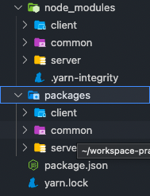
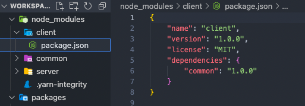
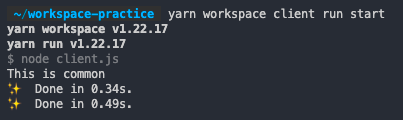

# 모노레포 툴 학습

## Yarn workspaces

- **`yarn link` 혹은 `npm link` 기능을 선언적으로 사용**하는 방식
- `workspace` 에 대한 **심볼릭 링크**가 생성
  - 이를 통해 하나의 레포지토리 내 여러 프로젝트가 상호 참조

<br/>

### 용어

- **project** : 저장소
  - 하나 이상의 worktree 포함
  - 최소 한 개의 workspace(즉, 루트 workspace) 존재
- **workspace** : 모노레포 패키지
- **worktree** : 자식 workspace를 갖는 workspace
- **glob pattern** : 와일드카드 문자를 사용하여 일정한 형식의 파일 이름들을 저장하기 위한 패턴
  - ex) `testMatch: ["**/test/**/*.test.(ts|js)"]`

<br/>

### worktree 선언

- worktree를 구성하는 workspace의 위치를 glob 패턴의 배열로 나타낸다.

```json
// packages 폴더 내 모든 폴더가 workspace가 되도록 함
{
  "private": true,
  "workspaces": ["packages/*"]
}
```

<br/>

### workspace 추가



- `client`, `server`, `common` 세 개의 `workspace` 를 추가하고 `yarn` 명령을 실행하면 다음과 같이 루트 디렉토리에 `node_modules` 생성

<br/>

### workspace에 대한 명령 실행

특정 `workspace` 에 정의된 스크립트 실행

```sh
yarn workspace <WORKSPACE_NAME> <COMMAND_NAME>
```

<br/>

### workspace를 의존성으로 추가

패키지 간 의존성을 만들려면 다음 방법으로 가능

- `package.json` 에 의존성 명시
- `yarn workspace` 명령 활용

```sh
yarn workspace client add common@1.0.0
```

위 명령을 사용하면 다음과 같이 된다.



이렇게 되면 npm 레지스트리에 배포된 `common` 이란 이름의 패키지가 있다 해도, **의존성 버전을 충족하면 로컬에 존재하는 `common` workspace를 우선하여 설치**한다.

`client` 에서 `common` 의존성을 잘 부르는지 확인하기 위해 테스트를 진행한다.

우선 아래 파일들을 추가한다.

```js
// client/client.js
const common = require("common");
common.hello();
```

```js
// common/index.js
module.exports = {
  hello() {
    console.log("This is common");
  },
};
```

```json
// client/package.json
{
  "name": "client",
  "version": "1.0.0",
  "license": "MIT",
  "dependencies": {
    "common": "1.0.0"
  },
  "scripts": {
    "start": "node client.js"
  }
}
```

그리고 아래 명령어를 실행하면,

```sh
yarn workspace client run start
```



<br/>

### workspace 의존 관계 확인
