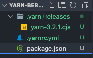
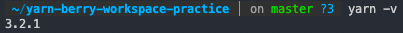

> [NAVER D2 : 모던 프론트엔드 프로젝트 구성 기법 - 모노레포 도구 편](https://d2.naver.com/helloworld/7553804#ch1)

# 모노레포 툴 학습 : Yarn Berry

- 보기 전 읽으면 좋은 내용

> **Yarn Hoisting 관련 글 : 유령 의존성 부분**
>
> [node_modules로부터 우리를 구원해 줄 Yarn Berry](https://toss.tech/article/node-modules-and-yarn-berry)

<br/>

## `node_modules` 의 문제점

`node_modules` 디렉토리를 활용하게 되면 다음 문제가 발생한다.

- 의존성 탐색 알고리즘의 비효율
- 저장 공간과 설치 시간
- 유령 의존성(phantom dependency)

<br/>

## Yarn Berry의 해결 방법 PnP

Berry는 `node_modules` 에 패키지 파일을 저장하는 방식 대신 패키지의 **압축 파일을 `.yarn/cache` 폴더에 수평적으로 저장하는 방식**으로 위 문제를 해결한다.

이 방식을 **Plug'n'Play(PnP)**라고 부르며, 모듈 로드가 필요할 때 ZipFS를 활용하여 압축을 해제하고 접근한다.

<br/>

## PnP로 얻는 것

- 빠른 의존성 검색
- 빠른 설치
- 유령 의존성 방지

<br/>

## zero-install 전략

압축 파일 단위로 의존성을 관리하고 해당 파일을 git으로 관리한다.

이러면 **설치 과정이 제거**되는데 이것을 zero-install이라고 하며, 장점은 다음과 같다.

- 다른 브랜치에서 새로운 의존성이 설치되었을 때 설치 과정 없이 바로 사용할 수 있다.
- CI에서 의존성 설치에 드는 시간을 크게 줄일 수 있다.

<br/>

## 오프라인 캐시

> [Offline Cache](https://yarnpkg.com/features/offline-cache)

네트워크가 다운되도 Yarn이 작동되도록 하는 기능

<br/>

## 사용 방법

프로젝트 디렉토리를 생성하고 다음 명령어를 실행한다.

```sh
yarn init -y # -y : default 생성
yarn set version berry
```

그러면 다음 초기 파일이 생성된다.



버전 확인을 해보면 다음과 같이 나온다.



의존성을 추가하면 `.yarn/cache` 경로에 추가된다.

<br/>

## .pnp.cjs

`.pnp.cjs` 파일 내 들어있는 정보는 다음과 같다.

- 모든 의존성 메타 정보
  - zip 경로, 의존성
- ZipFS에 대한 처리 코드

따라서 Berry 기반의 프로젝트는 `node src/main.js` 와 같은 명령으로는 실행할 수 없고 `yarn node src/main.js` 와 같이 Yarn을 통해서 실행해야 한다.

```json
{
  "scripts": {
    "start": "node src/main.js"
  }
}
```
