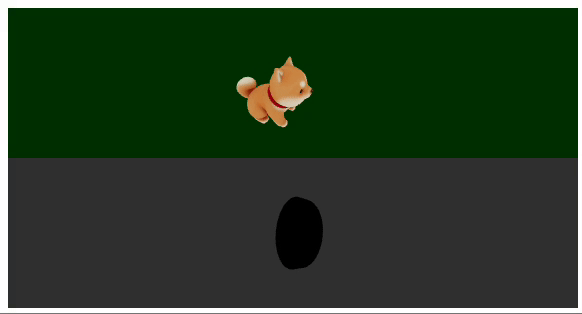
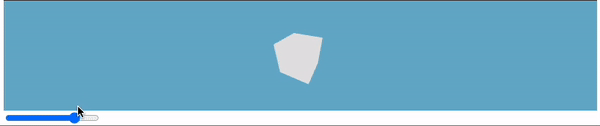
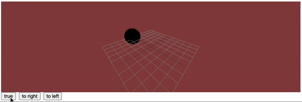
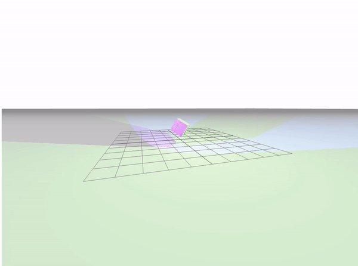
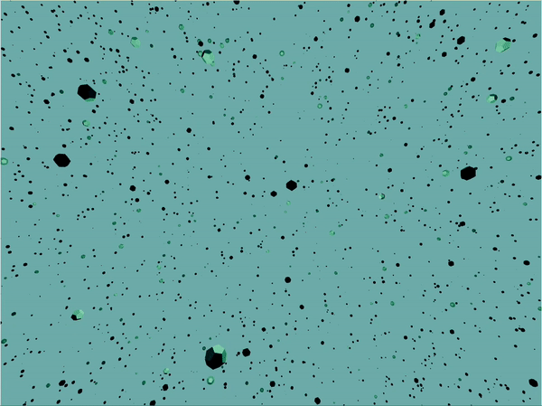

> 이전 학습 내용 스킵

# 220626 : `gltf` 파일 로드하고 애니메이션 추가



```tsx
import { useGLTF } from "@react-three/drei";
import { useFrame } from "@react-three/fiber";
import { useRef } from "react";

const Gltf = () => {
  const mesh = useRef(null);
  const gltf = useGLTF("/shiba/scene.gltf");
  useFrame(() => (mesh.current.rotation.y = mesh.current.rotation.z += 0.1));
  return (
    <mesh ref={mesh}>
      <primitive object={gltf.scene} />
    </mesh>
  );
};

useGLTF.preload("/shiba/scene.gltf");

export default Gltf;
```

## `gltf` 확장자 파일 로드하기

- `useGLTF` 훅 사용
  - 인자로 `gltf` 파일 경로(`string)` 할당
  - 이를 `primitive` 태그에 `gltf` 객체의 `scene` 참조하여 할당
- `preload` 부분 예제에 있어서 작성하긴 했는데 왜 추가되었는지 모름

## 애니메이션 추가

- `useFrame` 훅과 `useRef` 훅 사용
  - `mesh` 태그 생성하여 앞의 `primitive` 태그 래핑
  - 해당 `mesh` 태그에 `ref` 값 할당
    - `ref` 초기값 `null` 할당
  - `useFrame` 훅을 통해 프레임당 추가될 애니메이션 작성

<br/>

# 220627 : `react-three-fiber` 공식 문서 분석

## `<Canvas>`

- 렌더링에 필요한 기본 빌딩 블록인 **`Scene` 과 `Camera` 를 설정한다.**
- 매 프레임마다 장면을 렌더링하므로 기존의 `render-roop` 가 필요하지 않다.

> Canvas는 부모 노드에 맞게 반응하므로 부모 너비와 높이를 변경하여 크기를 제어할 수 있다(이 경우 #canvas-container).

<br/>

## `<mesh>`

장면 에서 실제로 무엇을 보기 위해 `<mesh />` 를 추가한다.

- 이는 `new THREE.Mesh()` 와 같다.

> 이때 **아무것도 `import` 할 필요가 없다.** 왜냐하면 리액트에서 **모든 `three.js` 객체는 기본 `JSX` 요소로 처리**되기 때문이다.
>
> 일반적으로 `Fiber` 컴포넌트는 **카멜 케이스**로 작성한다.

- `<mesh>` 는 `three.js` 의 기본 장면 객체이며 3D 공간에서 `shape` 을 나타내는데 필요한 `geometry` 와 `material` 을 유지하는데 사용된다.

아래 두 코드는 동일하다.

```jsx
// react-three-fiber

<Canvas>
  <mesh>
    <boxGeometry />
    <meshStandardMaterial />
  </mesh>
</Canvas>
```

```js
// three.js

const scene = new THREE.Scene();
const camera = new THREE.PerspectiveCamera(75, width / height, 0.1, 1000);

const renderer = new THREE.WebGLRenderer();
renderer.setSize(width, height);
document.querySelector("#canvas-container").appendChild(renderer.domElement);

const mesh = new THREE.Mesh();
mesh.geometry = new THREE.BoxGeometry();
mesh.material = new THREE.MeshStandardMaterial();

scene.add(mesh);

function animate() {
  requestAnimationFrame(animate);
  renderer.render(scene, camera);
}

animate();
```

<br/>

## 생성자 인자

다음 [Three.js 공식 문서](https://threejs.org/docs/#api/en/geometries/BoxGeometry)에선 `width`, `height`, `depth` 에 대한 세 가지 인자를 선택적으로 전달할 수 있다.

```js
new THREE.BoxGeometry(2, 2, 2);
```

이와 같이 동작하기 위해 `Fiber` 에서는 `args` 라는 `prop` 으로 배열을 전달합니다.

```jsx
<boxGeometry args={[2, 2, 2]} />
```

> `args` 변경마다 객체를 다시 구성해야 합니다.

### 응용



`state` 값을 `type="range"` 인 `input` 으로 핸들링하여 값 변경

<br/>

## 조명 추가하기

- 요소에 빛과 관련된 요소를 핸들링 할 수도 있습니다.

```jsx
<directionalLight color="blue" position={[5, 5, 5]} intensity={0.2} /> // 카메라 기준 정면 쪽 빛
<ambientLight color="green" position={[5, 5, 5]} intensity={0.2} /> // 카메라 기준 외곽 쪽 빛
```

<br/>

# 220628 : `useSpring` 같이 사용하기

> 참고 : [Using with React Spring](https://docs.pmnd.rs/react-three-fiber/tutorials/using-with-react-spring)



## 패키지 설치

```bash
npm install @react-spring/three
```

or

```bash
yarn add @react-spring/three
```

<br/>

## 활용

- 호출부

```js
import { animated, useSpring } from "@react-spring/three";
```

- `props` 생성

```js
const props = useSpring({
  scale: isGrow ? [1.5, 1.5, 1.5] : [0.5, 0.5, 0.5],
  position,
  config: config.stiff,
});
```

- `animated.mesh` 생성 후 `props` 할당

```js
<animated.mesh {...props} ref={meshRef}>
  <sphereBufferGeometry />
  <meshPhongMaterial color="royalblue" />
</animated.mesh>
```

- `state` 값 등을 통해 `props` 내 값에 변화를 주어 애니메이션 실행

<br/>

## `config`

```js
import { config } from "@react-spring/three";
```

- `useSpring` 을 사용할 때, 애니메이션의 강약 조절 및 애니메이션 스타일을 정의할 수 있다.

<br/>

# 220629 : 그림자 및 불규칙 요소 렌더링

## 그림자 렌더링



```tsx
import { Box, Plane } from "@react-three/drei";
import { useFrame } from "@react-three/fiber";
import { useRef } from "react";
import { Mesh } from "three";

const ShadowBox = () => {
  const boxRef = useRef<Mesh>(null);

  useFrame(() => {
    boxRef.current!.rotation.y += 0.004;
    boxRef.current!.rotation.x += 0.004;
    boxRef.current!.rotation.z += 0.004;
  });

  return (
    <group>
      <Box castShadow receiveShadow ref={boxRef} position={[0, 0.5, 0]}>
        <meshStandardMaterial attach="material" color="white" />
      </Box>
      <Plane
        receiveShadow
        rotation={[-Math.PI / 2, 0, 0]}
        position={[0, -1, 0]}
        args={[1000, 1000]}
      >
        <meshStandardMaterial attach="material" color="white" />
      </Plane>
    </group>
  );
};

export default ShadowBox;
```

```tsx
<Canvas
  camera={{ position: [-3, 2, 10], fov: 90 }}
  style={{ height: "50rem" }}
  shadows
>
  <fog attach="fog" args={["#cecece", 0, 100]} />
  <ambientLight intensity={0.1} />
  <directionalLight
    intensity={0.5}
    castShadow
    shadow-mapSize-height={512}
    shadow-mapSize-width={512}
  />
  <pointLight
    castShadow
    intensity={20}
    args={["green", 1, 100]}
    position={[1, 1, 1]}
  />
  <spotLight
    castShadow
    intensity={20}
    args={["blue", 1, 100]}
    position={[-1, 1, 1]}
  />
  <gridHelper position={[0, -0.5, 0]} />
  <ShadowBox />
</Canvas>
```

## [`@react-three/drei`](https://www.npmjs.com/package/@react-three/drei)

- `react-three-fiber` 에서 활용할 기성 추상화 컬렉션
- 일반적인 구성 요소를 단순 컴포넌트로 구현 가능

### Props 정리

- `castShadow` : `lightObject` 를 통해 `shadow` 를 만드는 대상에 지정
- `receiveShadow` : `shadow` 가 표현될 대상

## [`<meshStandardMaterial>`](https://sbcode.net/threejs/meshstandardmaterial/)

- [물리 기반](https://en.wikipedia.org/wiki/Physically_based_rendering) 렌더링 방식

## 캔버스 Props

### [`<Canvas>`](https://docs.pmnd.rs/react-three-fiber/api/canvas)

- `shadow` : 기본값 `false`, 그림자 반영 여부

## scene 객체

### [`<fog>`](https://threejs.org/docs/#api/en/scenes/Fog)

- 선형 안개 표현
- `args` : `{[color, near, far]}`
  - `near` : 카메라 기준 가까이 얼마나
  - `far` : 카메라 기준 멀리 얼마나

## light 객체

- `intensity` : 빛의 강도

### [`<ambientLight>`](https://threejs.org/docs/?q=ambientLight#api/en/lights/AmbientLight)

- scene 내 모든 대상에 전체적으로 균일하게 비추는 빛

### [`<pointLight>`](https://threejs.org/docs/?q=ambientLight#api/en/lights/PointLight)

- 단일 지점에서 모든 방향으로 비추는 빛

### [`<spotLight>`](https://threejs.org/docs/?q=ambientLight#api/en/lights/SpotLight)

- 단일 지점에서 한 방향으로 멀어질수록 크기가 커지는 원뿔 형태의 빛

<br/>

## 불규칙 요소 렌더링



```tsx
import * as THREE from "three";
import React, { useRef, useMemo } from "react";
import { useFrame, useThree } from "@react-three/fiber";
import { InstancedMesh, PointLight } from "three";

export default function Particles({ count, mouse }) {
  const mesh = useRef<InstancedMesh>(null); // instancedMesh 오브젝트 ref
  const light = useRef<PointLight>(null); // light 객체 ref
  const { size, viewport } = useThree();
  /*
  size: view 범위(100% 확장 및 자동 조정)
  viewport: 3D 단위 및 요소(size/viewport)의 viewport 범위
  */
  const aspect = size.width / viewport.width; // 관점?

  const dummy = useMemo(() => new THREE.Object3D(), []);

  // particle 배열 count 만큼 생성
  const particles = useMemo(() => {
    const temp: any[] = [];
    for (let i = 0; i < count; i++) {
      const t = Math.random() * 100;
      const factor = 20 + Math.random() * 100;
      const speed = 0.01 + Math.random() / 200;
      const xFactor = -50 + Math.random() * 100;
      const yFactor = -50 + Math.random() * 100;
      const zFactor = -50 + Math.random() * 100;
      temp.push({ t, factor, speed, xFactor, yFactor, zFactor, mx: 0, my: 0 });
    }
    return temp;
  }, [count]);

  useFrame(() => {
    light.current!.position.set(
      mouse.current[0] / aspect,
      -mouse.current[1] / aspect,
      0
    );

    // Matrics4 행렬을 정의된 인스턴스(instancedMesh)에 설정
    particles.forEach((particle, i) => {
      let { t, factor, speed, xFactor, yFactor, zFactor } = particle;

      t = particle.t += speed / 2;
      const a = Math.cos(t) + Math.sin(t * 1) / 10;
      const b = Math.sin(t) + Math.cos(t * 2) / 10;
      const s = Math.cos(t);
      particle.mx += (mouse.current[0] - particle.mx) * 0.01;
      particle.my += (mouse.current[1] * -1 - particle.my) * 0.01;

      dummy.position.set(
        // Object의 로컬 위치. default는 Vector3(0, 0, 0)
        (particle.mx / 10) * a +
          xFactor +
          Math.cos((t / 10) * factor) +
          (Math.sin(t * 1) * factor) / 10,
        (particle.my / 10) * b +
          yFactor +
          Math.sin((t / 10) * factor) +
          (Math.cos(t * 2) * factor) / 10,
        (particle.my / 10) * b +
          zFactor +
          Math.cos((t / 10) * factor) +
          (Math.sin(t * 3) * factor) / 10
      );
      dummy.scale.set(s, s, s); // scale : Object의 로컬 규모. default는 Vector3(1, 1, 1)
      dummy.rotation.set(s * 5, s * 5, s * 5); // rotation : radian 단위의 Object 로컬 회전
      dummy.updateMatrix();

      mesh.current!.setMatrixAt(i, dummy.matrix); // setMatrixAt 이하 설명
    });
    mesh.current!.instanceMatrix.needsUpdate = true; // setMatrixAt 설명 참조
  });
  return (
    <>
      <pointLight ref={light} distance={40} intensity={8} color="lightblue" />
      <instancedMesh ref={mesh} args={[undefined, undefined, count]}>
        <dodecahedronGeometry args={[0.2, 0]} />
        <meshPhongMaterial color="#366d4a" />
      </instancedMesh>
    </>
  );
}
```

```tsx
<Canvas style={{ height: "50rem" }}>
  <Particles count={10000} mouse={mouse} />
  <color attach="background" args={["#b6dbd9"]} />
</Canvas>
```

## [`useThree`](https://gracious-keller-98ef35.netlify.app/docs/api/hooks/useThree/)

- 기본 렌더러, `scene`, `camera` 와 같이 내부적으로 유지되는 모든 기본 객체에 액세스할 수 있는 훅.
- `Canvas` 컴포넌트 안에서 사용해야 함

## [`Mesh.setMatricsAt(index, matrics)`](https://threejs.org/docs/#api/en/objects/InstancedMesh.setMatrixAt)

- 지정된 `local transformation matrix` 를 정의된 인스턴스로 설정합니다.
- 다 설정한 뒤에 `intanceMatrics.needsUpdate()` 를 설정했는지 확인해야 합니다.

## [`Object3D.updateMatrics()`](https://threejs.org/docs/#api/en/core/Object3D.updateMatrix)

- Updates the local transform : 로컬 변화를 업데이트 한다.

## [`instancedMesh`](https://threejs.org/docs/?q=instancedMesh#api/en/objects/InstancedMesh)

- 인스턴스 렌더링을 지원하는 `Mesh`
- 동일한 Geometry와 material을 사용하지만 다수의 변환이 많은 오브젝트를 렌더링해야 하는 경우 사용
- draw call을 줄여 렌더링 성능 향상에 도움이 됨

## [`dodecahedronGeometry`](https://threejs.org/docs/?q=dodecahedronGeometry#api/en/geometries/DodecahedronGeometry)

- 12면체 : `(radius: float, detail: interger)`
  - `radius` : 12면체 반지름. default 1
  - `detail` : default 0. 0보다 큰 값으로 설정하면 꼭지점이 추가되어 더이상 12면체가 아님

## [`meshPhongMaterial`](https://threejs.org/docs/?q=meshPhongMaterial#api/en/materials/MeshPhongMaterial)

- 물리적 기반이 아닌 [Blinn-Phong](https://en.wikipedia.org/wiki/Blinn%E2%80%93Phong_reflection_model) 모델 사용
- 광택 처리 표현 가능
