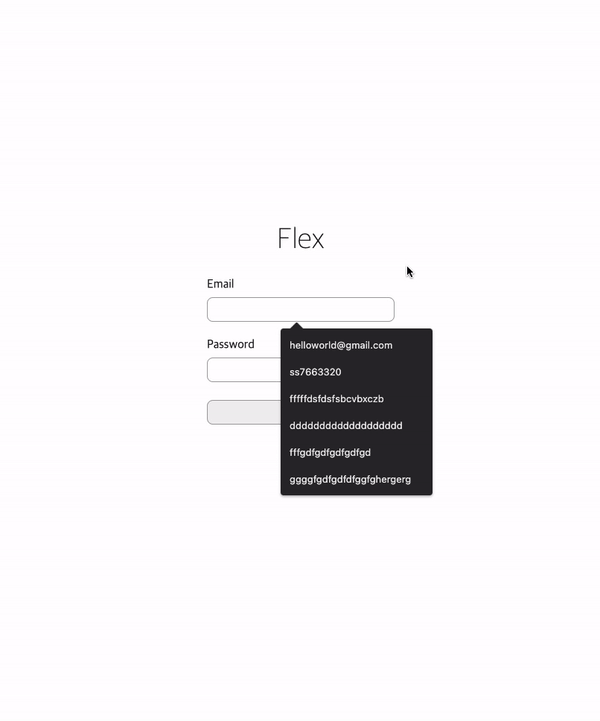
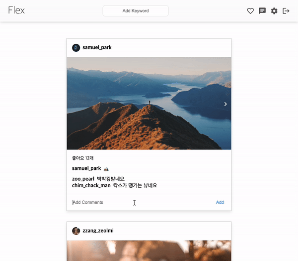
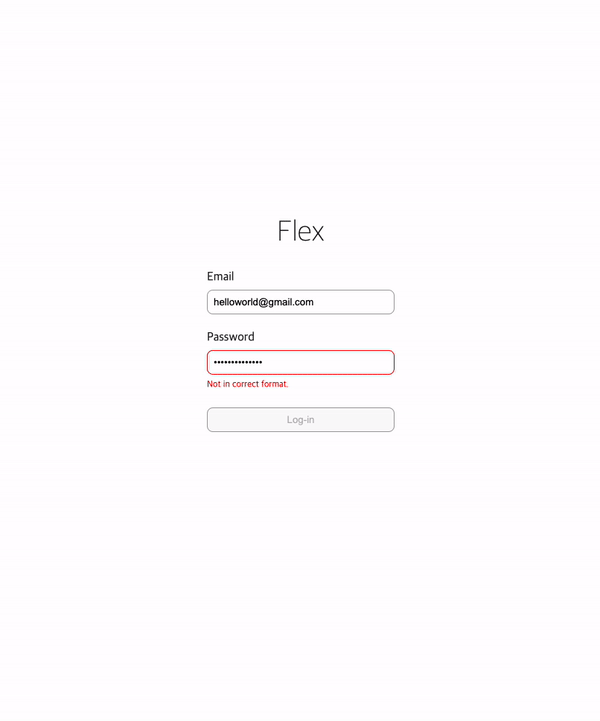

# 최적화



## `onChange` 렌더링 최소화 하기

기존에 `onChange` 를 통해 `input` 내 `value` 를 저장하여 핸들링 하던 방식에서 유효성 검사 결과만을 활용하는 방식으로 전환

### 세부 내용

```js
const validateAccount = useCallback(
  (event) => {
    const { name, value } = event.target;

    // case 1 : input value 없음
    if (!value) {
      setCheck((prev) => ({ ...prev, [name]: "empty" }));
      return;
    }

    // case 2 : validation 통과 실패
    if (!validate(name, value) && check[name] !== "invalid") {
      setCheck((prev) => ({ ...prev, [name]: "invalid" }));
      return;
    }

    // case 3 : validation 통과
    if (validate(name, value)) {
      setCheck((prev) => ({ ...prev, [name]: "" }));
      return;
    }
  },
  [check, validate]
);
```

- 사용한 상태 값
  - `check`(`{ id: string, pw: string }`): `validation` 결과를 `check` 의 각 필드에 저장하여 이를 `HintText` 에 할당
  - 유효성 검사가 통과된 경우 빈 문자열을 할당하여 `distructure` 상태 핸들링

<br/>

## Authorization 방식 전환

`ref` 를 통해 각 `input` 의 값을 인증 처리

```javascript
const submitAccount = (event) => {
  event.preventDefault();

  const {
    current: { value: idValue },
  } = idRef;
  const {
    current: { value: pwValue },
  } = pwRef;

  if (!idValue || !pwValue) return;

  if (idValue === TEST_ACCOUNT.id && pwValue === TEST_ACCOUNT.password) {
    localStorage.setItem("jwt", "success");
    alert("success!");
    location.reload();

    return;
  }

  alert("일치하지 않습니다.");
};
```

이를 통해 `input` 의 `value` 를 지속적으로 갖고 있을 필요가 사라짐

<br/>

## `memo` 사용

`React.memo` 를 사용하여 값 변경이 일어난 컴포넌트만 리렌더링 진행

```js
const InputField = forwardRef(({ check, name }, ref) => {
  return (
    <Label>
      <LabelText>{ACCOUNT_INFO[name].label}</LabelText>
      <Input
        ref={ref}
        type={ACCOUNT_INFO[name].type}
        name={name}
        distructure={check}
      />
      {check && <HintText>{VALIDATION_HINT_TEXT[check]}</HintText>}
    </Label>
  );
});

InputField.displayName = "InputField";

export default memo(InputField);
```

<br/>

피드 페이지 내에서도 `Comment` 를 `memo` 로 감사 최적화

```js
import React, { memo } from "react";
import styled from "styled-components";

import { Text } from "../../Card";

const Comment = ({ userName, contents }) => {
  return (
    <CommentBox>
      <Text $type="name">{userName}</Text>
      <Text>{contents}</Text>
    </CommentBox>
  );
};

export default memo(Comment);

const CommentBox = styled.div`
  display: flex;
  gap: 8px;
`;
```

### 댓글 최적화 전



### 댓글 최적화 후


<br/>

# 인증 여부에 따른 리다이렉팅



루트 경로 렌더링 시, `token` 유무에 따라 페이지 조건부 렌더링

```js
import React from "react";

import SignIn from "./SignIn";

const Dashboard = () => {
  const token = localStorage.getItem("jwt");

  if (!token) return <SignIn />;

  return <div>Dashboard</div>;
};

export default Dashboard;
```

`token` 이 존재할 경우, 페이지를 껐다가 다시 루트 경로로 접근할 때 `Dashboard` 페이지 렌더링

<br/>
